```{r setup, include=FALSE}
library(ggplot2)
library(magrittr)
library(knitr)
library(tidymodels)
library(tidyverse)
library(kableExtra)
theme_set(theme_minimal(14))
options(htmltools.dir.version = FALSE, fig.retina = 2)
```

## Professores

.pull-left[


#### Athos Damiani

Estatístico no IME/USP

Senior Data Scientist na Nubank

]

.pull-right[


#### Daniel Falbel

Estatístico no IME/USP

Software Engineer na RStudio

]

---

## Dinâmica curso

- As aulas serão um espaço de teoria, exemplos e dúvidas.

- Teremos exercícios para serem feitos "em casa" e um trabalho final (Kaggle!). **Com exceção da entrega final, nenhum exercício precisará ser entregue**.

- O certificado será emitido mediante uma **entrega final**. O prazo da entrega final será estabelecido ao longo do curso.

- Haverá monitoria para esclarecimento de dúvidas sempre 30 minutos antes do início das aulas.

---

## Tirando dúvidas

- **Não existe dúvida idiota**.

- Fora do horário de aula ou monitoria:
  - perguntas gerais sobre o curso deverão ser feitas no Classroom.

  - perguntas sobre R ou Machine Learning, principalmente as que envolverem código, sugerimos serem enviadas no [nosso discourse](https://discourse.curso-r.com/).

---

## Por que usar o discourse?

- Muito melhor para escrever textos que possuem códigos. Com ele, podemos usar o pacote `{reprex}`! [Veja aqui dicas de como fazer uma boa pergunta](https://discourse.curso-r.com/t/como-escrever-uma-boa-pergunta/542).


- Aprender a pesquisar sobre erros que o R solta e fazer a pergunta certa é essencial para aprender e resolver problemas de programação.

- No discourse, teremos mais pessoas acompanhando e respondendo as dúvidas.

- Em um ambiente aberto, as suas dúvidas vão contribuir com a comunidade (a sua dúvida pode ser a mesma que a da outra pessoa!).

### [https://discourse.curso-r.com/](https://discourse.curso-r.com/)


---

# Conteúdo

- Introdução

- Árvore de Decisão - Mini-revisão

- XGBoost - Teoria

- XGBoost - passo a passo

- Hiperparâmetros/Estratégias


---

# Agenda

.pull-left[
### Aulas 1 e 2 - Intro e Teoria

- Google Classroom + Introdução
- Mostrar as contas na mão num exemplo de 4 pontos (regressão)
- Mostrar as diferenças entre classificação e regressão
- Exercícios de Script (algoritmo na mao feito em R)

]


.pull-right[

### Aula 3 - Na prática
- Pacote tidymodels
- Como que a matriz X tem que ir (dummy etc)
- Overfitting/Computação
- Exercício de treino de tunagem
- Kaggle InClass
]


---


# Referências

.pull-left[
<a href = "https://web.stanford.edu/~hastie/Papers/ESLII.pdf">
</img>
</a>
]

.pull-right[
<a href = "https://web.stanford.edu/~hastie/ISLR2/ISLRv2_website.pdf">
</img>
</a>
]

---


# Referências

.pull-left[
<br>

<br>

<a href = "https://xgboost.readthedocs.io/en/latest/tutorials/model.html">
</img>
</a>
]

.pull-right[
<a href = "https://www.youtube.com/user/joshstarmer">
</img>
</a>
]


---


# Referências

.pull-left[
<br>

<br>

<a href = "https://www.tmwr.org/">
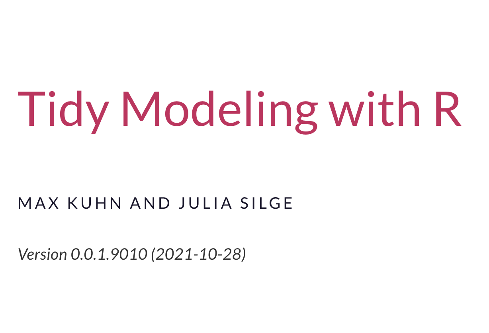</img>
</a>
]

.pull-right[
<a href = "hhttps://www.tidymodels.org/">
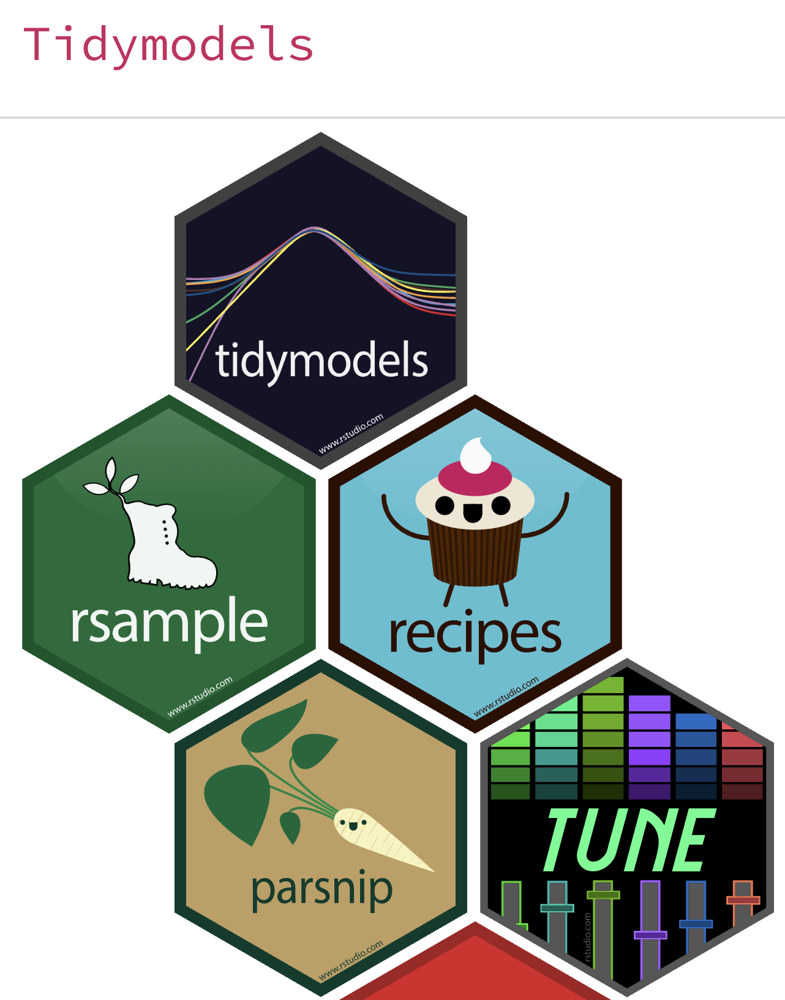</img>
</a>
]

---

# XGBoost

<a href = "https://towardsdatascience.com/how-i-got-in-the-top-1-on-kaggle-79ddd7c07f1c">
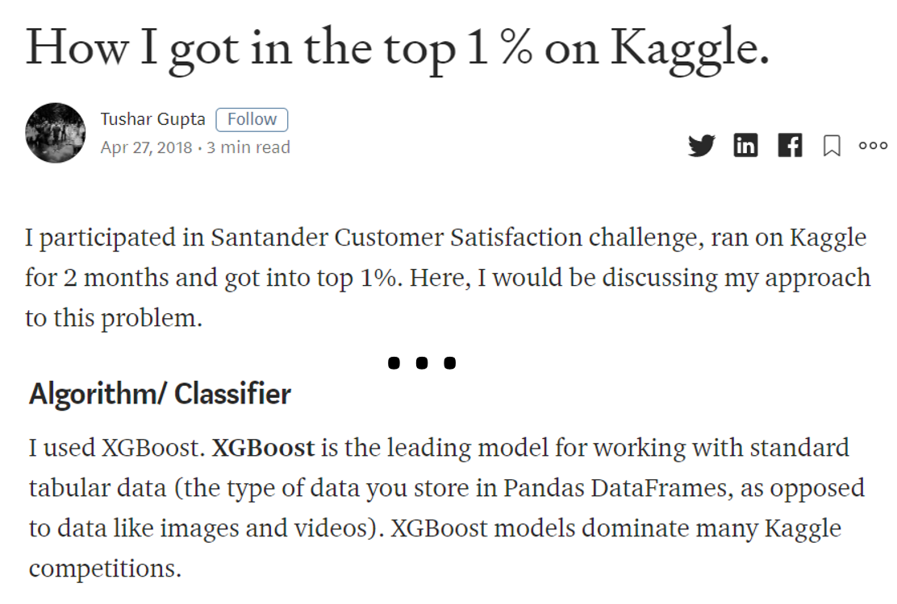</img>
</a>


---

# XGBoost

<a href = "https://twitter.com/rasbt/status/1402290438803951628?s=20">
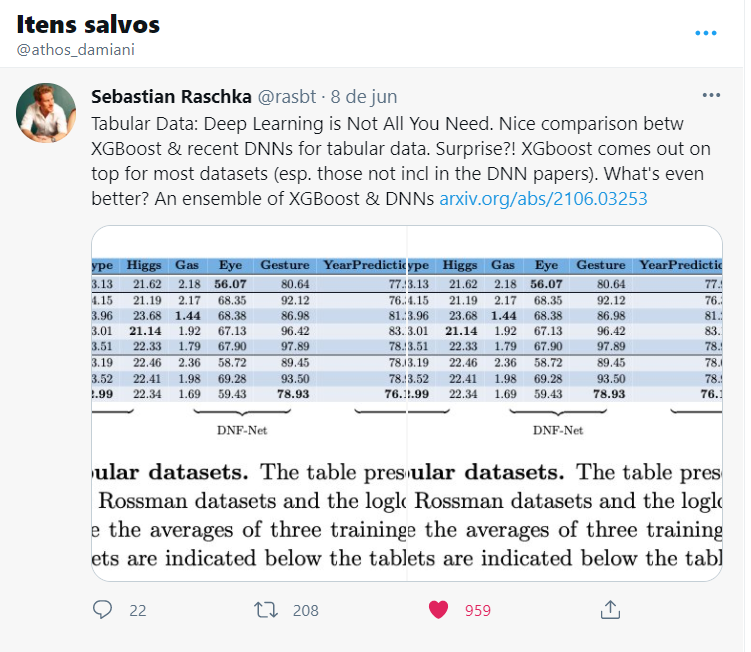</img>
</a>


---

## Alinhamento de conceitos

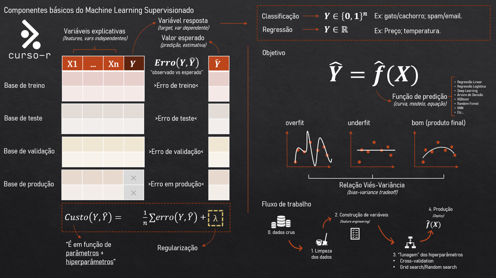

---

# XGBoost

.pull-left[


## O que XGBoost é:

- Um algoritmo de machine learning

- Um modelo estatístico

- Um fornecedor de probabilidades/estimativas

- Um "concorrente" de regressão logística, random forest, redes neurais, etc.

- Difícil de entender =)

]

.pull-right[


## O que XGBoost NÃO é:

- Magia

- Bala de prata para qualquer problema

- Pior que deep learning

- Melhor que deep learning

]

---

# XGBoost

.pull-left[

### Coisas boas

- Bom para dados tabulares. Preparado para bases arbitrariamente grandes.

- Serve para classificação, regressão, séries temporais, ranqueamento, análise de sobrevivência.

- Bom para quando precisamos de boas previsões.

- Implementado nas principais ferramentas de ciência de dados.

]

.pull-right[

### Coisas ruins

- Possui mais hiperparâmetros do que os demais algoritmos.

- Difícil de explicar ao gestor como funciona em poucas palavras.

- Menos interpretável do que regressão linear e árvore de decisão.

]

---

# XGBoost

## Objetivos do Curso

Ao final do curso, a aluna/o aluno 

- Saberá explicar como o XGBoost funciona.

- Terá mais uma opção de escolha além da regressão logística/linear, random forest, redes neurais, knn, entre outras.

- Ficará a vontade em propor o uso de XGBoost em seu trabalho.

---

class: sem-padding


---

# No R

```{r, eval=FALSE}
# XGBoost
modelo_xgb <- boost_tree(
  min_n = tune(),
  mtry = tune(),
  trees = tune(),
  tree_depth = tune(),
  learn_rate = tune(),
  loss_reduction = tune(),
  sample_size = tune() 
)
```


---

# Intuição das somas de árvores

.pull-left[

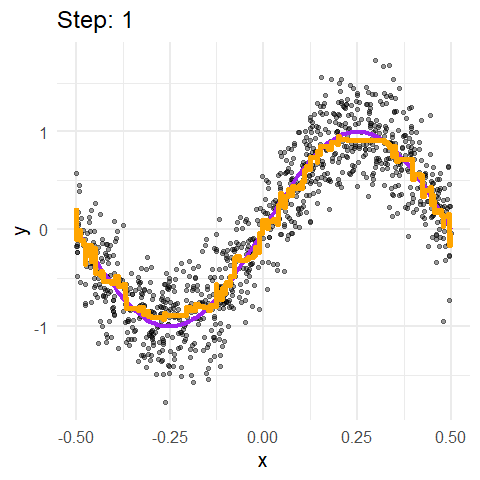

]

.pull-right[

Cada "step" é uma árvore

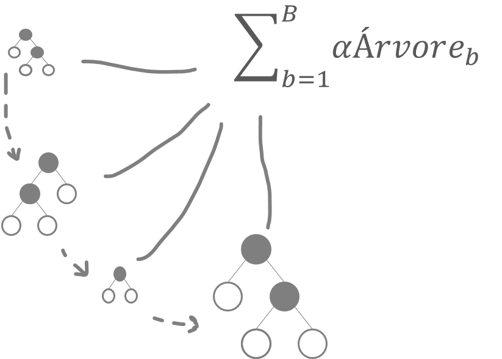

]


---

class: middle, center

# 01-exemplo-hiperparametros-sql.R

---

class: inverse, middle, center

# XGBoost

## Exemplo passo-a-passo (no pptx)


---

#Intuição dos hiperparâmetros


---

#Intuição dos hiperparâmetros

.pull-left[
```{r}
modelo <- boost_tree(
  mtry = 1, 
  trees = 100, 
  min_n = 1, 
  tree_depth = 1, 
  learn_rate = 1,
  sample_size = 1, 
  loss_reduction = 1
)
```
]

.pull-right[


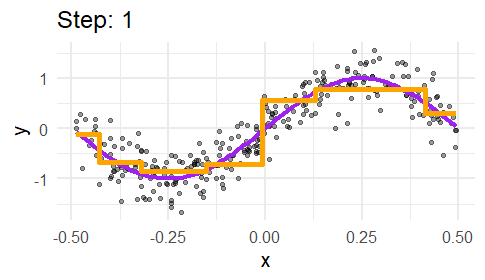


]

.pull-left[

```{r}
modelo <- boost_tree(
  mtry = 1, 
  trees = 100, 
  min_n = 1, 
  tree_depth = 2, #<<
  learn_rate = 1,
  sample_size = 1, 
  loss_reduction = 1
)
```

]

.pull-right-abaixo[

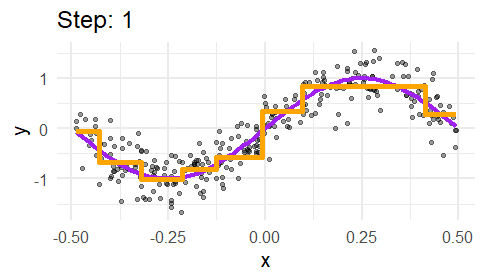

]

---

#Intuição dos hiperparâmetros

.pull-left[
```{r}
modelo <- boost_tree(
  mtry = 1, 
  trees = 100, 
  min_n = 1, 
  tree_depth = 1, 
  learn_rate = 0.1, #<<
  sample_size = 1, 
  loss_reduction = 1
)
```
]

.pull-right[


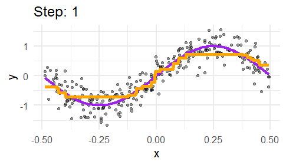


]

.pull-left[

```{r}
modelo <- boost_tree(
  mtry = 1, 
  trees = 100, 
  min_n = 1, 
  tree_depth = 1, 
  learn_rate = 1,
  sample_size = 0.5, #<<
  loss_reduction = 1
)
```

]

.pull-right-abaixo[

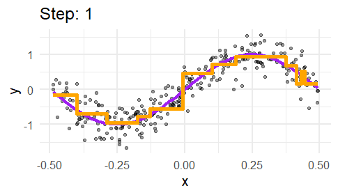

]


---

#Intuição dos hiperparâmetros

.pull-left[
```{r}
modelo <- boost_tree(
  mtry = 1, 
  trees = 100, 
  min_n = 1, 
  tree_depth = 1, 
  learn_rate = 1, 
  sample_size = 1, 
  loss_reduction = 0.1 #<<
)
```
]

.pull-right[


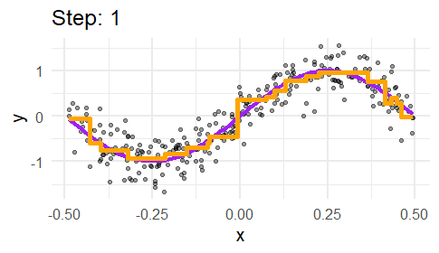


]

.pull-left[

```{r}
modelo <- boost_tree(
  mtry = 1, 
  trees = 100, 
  min_n = 1,  
  tree_depth = 2, #<<
  learn_rate = 0.1, #<<
  sample_size = 0.5, #<<
  loss_reduction = 0.1 #<<
)
```

]

.pull-right-abaixo[


]


---

# Extrapolação dos modelos de árvores

```{r, echo=FALSE, fig.asp=0.5, fig.width=14}
set.seed(1)
dados <- tibble(
  x = runif(200) - 0.5,
  y = sin(x * pi * 2) + rnorm(200, sd = 0.3)
)

modelo <- boost_tree(
  mode = "regression", 
  mtry = 1, 
  trees = 250, 
  min_n = 2, 
  tree_depth = 5, 
  learn_rate = 0.1, 
  sample_size = 0.9, 
  loss_reduction = 0.9
) %>%
  set_engine("xgboost", base_score = 0)

ajuste <- fit(modelo, y ~ x, data = dados)

dados_xgb <- dados %>% select(x) %>% as.matrix()


dados_extr <- tibble(x = seq(-1, 1, length.out = 1000)) 
dados_xgb_extr <- dados_extr %>% select(x) %>% as.matrix()
dados_extr <- dados_extr %>%
  mutate(
    pred = xgboost:::predict.xgb.Booster(ajuste$fit, newdata = dados_xgb_extr, ntreelimit = 0)
  )

dados %>%
  mutate(
    pred = xgboost:::predict.xgb.Booster(ajuste$fit, newdata = dados_xgb, ntreelimit = 0)
  ) %>%
  ggplot(aes(x = x)) +
  geom_point(aes(y = y), size = 2, alpha = 0.4) +
  stat_function(fun = ~sin(. * pi * 2), colour = "purple", size = 1.5) +
  geom_step(aes(y = pred), colour = "orange", size = 2) +
  geom_step(aes(y = pred), colour = "orange", size = 2, linetype = "dashed", data = dados_extr) +
  theme_minimal(30)
```


---

class: inverse, middle, center

# XGBoost

## Na prática

---

# Sobre os problemas nos dados

- XGBoost trata missing automaticamente dentro dele, não precisa tratar. Porém, sempre vale técnicas de imputação para tentar aprimorar o modelo!

- Multicolinearidade não é um problema grave para modelos de árvore. Mas é sempre bom filtrar variáveis explicativas muito correlacionadas. [Ler esse post para exemplo.](https://www.curso-r.com/blog/2018-05-22-arvore-e-multicolinearidade/)

- Variável resposta precisa ir como factor. Não pode ser character nem 0/1.

- As variáveis categóricas precisam ser "dummyficadas" antes. XGBoost só aceita explicativas numéricas.

- A escala das variáveis explicativas não atrapalham modelos de árvores.

- A assimetria das variáveis explicativas não atrapalham modelos de árvores.

